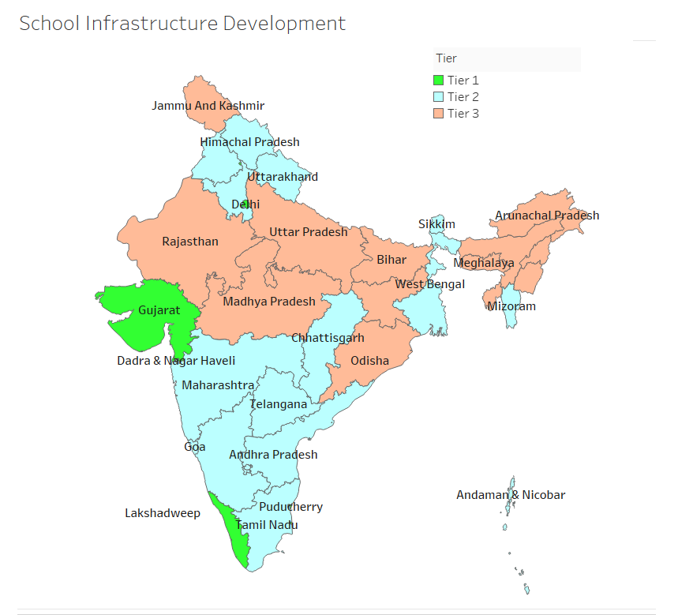

```{r setup, include=FALSE}
library(knitr)
knitr::opts_chunk$set(echo = FALSE, message=FALSE, dpi=300)
```

## Objective of the Study

The aim of this study is to determine the state-wise level of infrastructure development of schools in India on the basis of basic facilities provided by the school. Based on this criteria, similar states can be clustered together so that the States belonging to the same cluster can have a common development policy and strategy.

## About Data

The data is broken down on state level. The values of variables 'Computer', 'Electricity', 'Water', 'Boys_washroom', and 'Girls_washroom' indicate the percentage of schools in that state having that respective facility. The data of year 2015-16 is used here, since it is the latest one available.

This dataset was compiled from five different files taken from Open Government Data platform: [data.gov.in/catalog/school-education-statistics](data.gov.in/catalog/school-education-statistics)

```{r, echo=TRUE, results="asis"}
library(readxl)
schools <- read_excel("schools_2016.xlsx")
schools<-data.frame(schools[,-1], row.names=schools$State_UT)
kable(head(schools))
dim(schools)
```

The value of first cell 57 indicates that in Andaman & Nicobar, 57% schools have computer facility.

Number of observations is 36, which is the number of States and Union territories in India. The five variables mentioned above are used to measure infrastructure development of schools.

\newpage

## Exploring Data

### Checking missing values and outliers

```{r, echo=TRUE, results="asis"}
kable(sapply(schools, function(x)sum(is.na(x))))
```

No missing observations are present in the data.

```{r, dpi=300, fig.width=9}
boxplot(schools, main="Boxplots", xlab="Infrasructure Facility",
        ylab="% Schools having the facility", col="lightblue")
```

In a typical state, very few schools have Computers. Electricity coverage varies from state to state. Overall, drinking water and washroom facilities are available for most of the schools across all states.

### Checking the distribution shape and correlation of variables

```{r}
library(psych)
pairs.panels(schools, pch=21, smooth=TRUE, scale=TRUE)
```

Boys_washroom and Girls_washroom variables have nearly perfect linear relationship. Therefore, we replace these two variables with a single variable named 'Washroom' whose value is their Geometric Mean.

Also, data does not need to be scaled, since each variable is measured in terms of percentage.

#### Final data that is used for clustering:

```{r, results="asis"}
schools$Washroom<-apply(schools[,c(4,5)], geometric.mean, MARGIN=1)
schools$Washroom<-round(schools$Washroom, 2)
schools<-schools[,-c(4,5)]
kable(head(schools))
```

\newpage

## Finding optimal number of clusters

While forming clusters, we try to minimize within-cluster sum of squares, and maximize between-cluster sum of squares.

```{r}
k.max<-15
wss <- sapply(1:k.max, 
              function(k){kmeans(schools, k, nstart=50,iter.max = 15)$tot.withinss})
bss <- sapply(1:k.max, 
              function(k){kmeans(schools, k, nstart=50,iter.max = 15)$betweenss})

totss <- kmeans(schools, 5)$totss

plot(1:k.max, wss,
     type="b", pch = 19, frame = FALSE, 
     xlab="Number of clusters K",
     ylab="Total within-clusters sum of squares",
     main="Scree Plot")
```

Scree plot suggests that either 3 or 4 clusters should be formed.

The variance in data that can be explained by clusters is the ratio of Between S.S. and Total S.S.

i.e. Variance explained = Between S.S. / Total S.S.

```{r, results='asis'}
var_exp<-data.frame("No_of_Clusters"=c(1:5), 
                    "Variance_Explained" = paste(round(bss[1:5]/totss,4)*100, "%",sep=""))
kable(var_exp, align = 'c')
```

From the above table, 3 clusters explain 83% variation whereas 4 clusters explain 89% variation. The difference is of only 6%.

\newpage

## Ward's Hierarchical clustering

```{r, fig.height=8, fig.width=8, dpi=300}
#library(ape)
dist_matrix<-dist(schools, method="euclidean")
wards_clust<-hclust(dist_matrix, method="ward.D")
wards_clust
plot(wards_clust, xlab="States", cex=0.8)
lines(1:36,rep(250,36), type='l',col='brown', lwd=1.5, lty=1)
lines(1:36,rep(115,36), type='l',col='green', lwd=1.5, lty=1)
legend("topright", legend=c("3 clusters", "4 clusters"), col=c("brown","green"),
       lty=1, title="Cut-off Point")

#plot(as.phylo(wards_clust), cex = 0.8, label.offset = 5)
```

Dendrogram suggests that either 3 or 4 clusters are suitable.

Taking the Sum of Squares Analysis and Ward's Clustering into consideration, we will proceed with 3 clusters.

## Applying k-means clustering for k=3

```{r, echo=TRUE}
set.seed(111)
schools_kmean <- kmeans(schools, 3)
schools_kmean$size
```

3 Clusters of sizes 17, 13, 6 respectively are formed.

The cluster assignments are as follows:

```{r}
schools_kmean$cluster
```

The following table contains values of **cluster centres**:

```{r}
schools_clusters<-cbind(data.frame("Cluster"=1:3,"Size"=schools_kmean$size),
                        round(schools_kmean$centers, digits=2),
                        "Tier"=c("Tier 2", "Tier 3", "Tier 1")) 
kable(schools_clusters, align = 'c')
```

**Cluster 3** consists of 6 states where almost every school has these infrastructure facilities. Among all variables, 'Computers' has lowest mean of 91%. Lets call these **'Tier 1' states**.

**Cluster 1** consists of 17 states where all facilities, except computers, are available in most of the schools. Although Electricity mean is 93%, the mean for Computer is only 42%. These are **'Tier 2' states**.

**Cluster 2** consists of 13 States which are under-performing in all 4 areas. These are **'Tier 3' states**.

Segregating the states into three tiers as per their cluster membership.

```{r, results="asis"}
state_tiers<-data.frame("State"=rownames(schools), "Cluster"=schools_kmean$cluster,
                        row.names = 1:length(schools_kmean$cluster))
state_tiers$Tier[schools_kmean$cluster==1]<-"Tier 2"
state_tiers$Tier[schools_kmean$cluster==2]<-"Tier 3"
state_tiers$Tier[schools_kmean$cluster==3]<-"Tier 1"

kable(head(state_tiers))
```

```{r}
library(factoextra)
fviz_cluster(schools_kmean, data=schools, repel=T, ellipse.type = "t",
             main="2-D Plot of 4-D Data")
```

Both the dimensions collectively explain 69.9% + 16.6% = **86.5% variance** in the data.



## Conclusion

The following conclusions are made on the basis of cluster centre values.

Nearly all the schools within the **Tier 1 states** have all infrastructure facilities. Very few schools do not have computers.

Most of the schools within **Tier 2 states** have access to basic facilities like Water, Electricity, and Washrooms. Despite of having electricity, many schools do not have computers. These states should focus on providing students with computers and other relevant technology.

**Tier 3 states** are under-performing in every aspect. A considerable proportion of Schools do not have access to even basic facilities like Drinking Water and Washroom. On average, only 90% schools have access to Water, and 95% schools have washrooms. This implies that 10% schools do not have access to water and 5% schools do not have washrooms. These States foremost ought to identify such schools and make sure that these basic human needs are fulfilled.

------------------------------------------------------------------------
